# Safety Backup System

**Safety Backup System** is a project complete of Client, Server and Remote Access software, developed to improve security of users. It's extremely useful to prevent data loss in case of cyberattack or hardware malfunction. SBS can backup computer files and send them to a remote server or store them in an external device.

# Client
This software runs in all Java-supported platforms, however it has some features that works in Windows environment only. The Client will copy selected files on a temporary folder, it'll zip them and, depending on what user had choosen, SBS will send the file to Server or Store it to another destination.

## Client Instructions
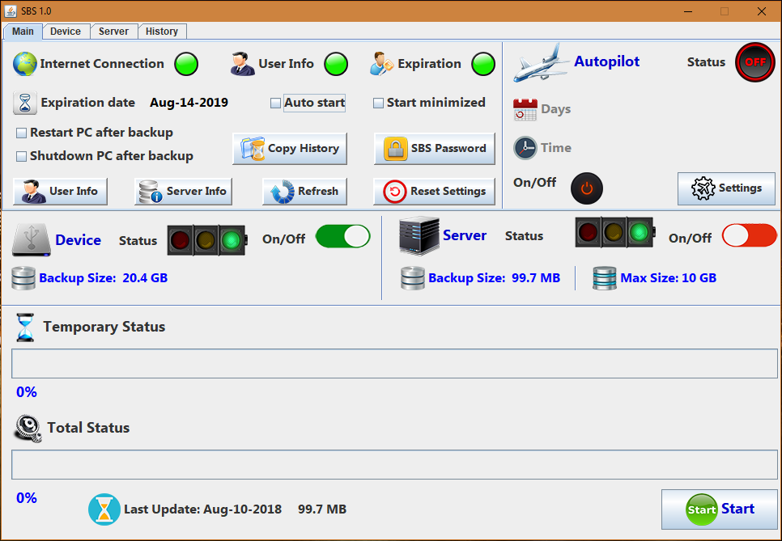
### First run
When a user run for the first time SBS, he must check if  **Server Info** is correctly set. It is a URL where the software will take the crypted information to parse (IP and ports).

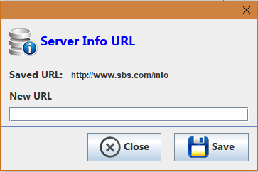

**Login**

Once "Server Info" is set, the user must login to be recognized by server. He must click on **User Info** and then enter User Code and Password (User must be registered into server database).

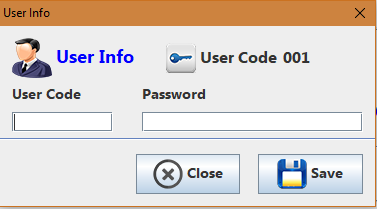

### Device Backup

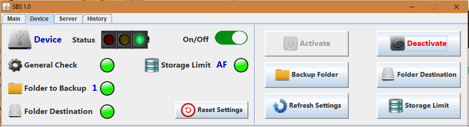

In "Device" user has a check panel, where he can manage settings for this backup type.

**Backup Folder**

The user can choose folders to backup. **Sync Device/Server Backup** is a feature that allows the software to use same file previously zipped to be managed by Server and Device backup.

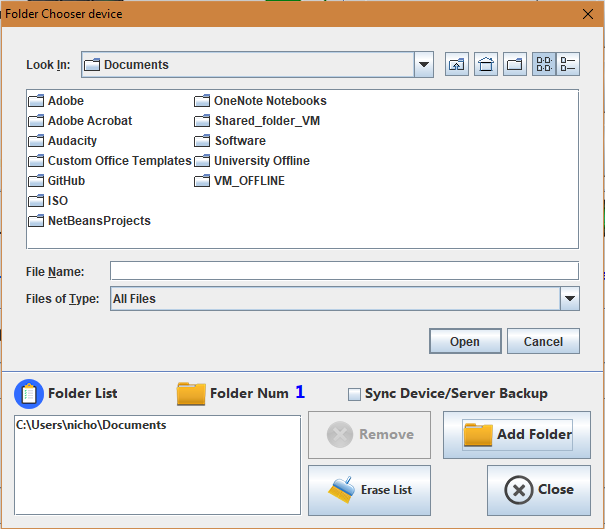

**Folder Destination**

The user must choose folder destination. It could be in a external device or into PC hard drive.

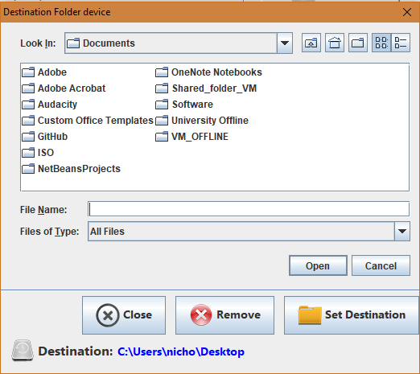

**Storage Limit**

This feature prevents to overload device memory, by deleting oldests backups. User can set a fixed storage limit or **Autofree** feature, which will automatically calculate the available space to store max number of backup.

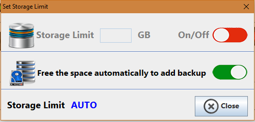

### Server Backup

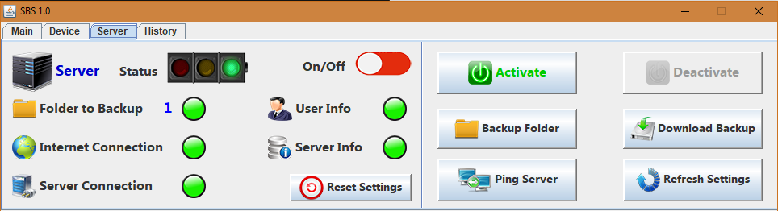

In "Server" user has a check panel, where he can manage settings for this backup type.
**Backup Folder** works like "Device Backup".

**Download Backup**

User can download from server one of his backup. He must click on "Refresh" to get the list of available files, then he must select a backup and press "Download". Finally, the user will choose a path where the file will be saved.

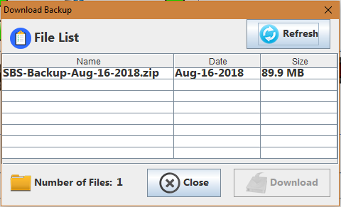

**History**

To check backup history, the user must click "Refresh"

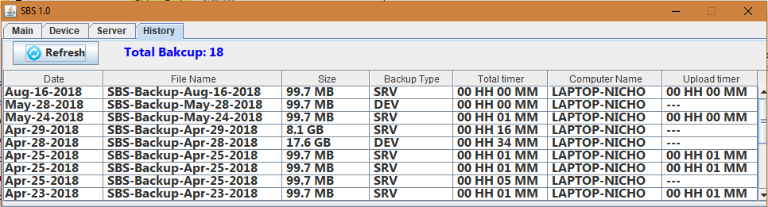

### Home Check Panel

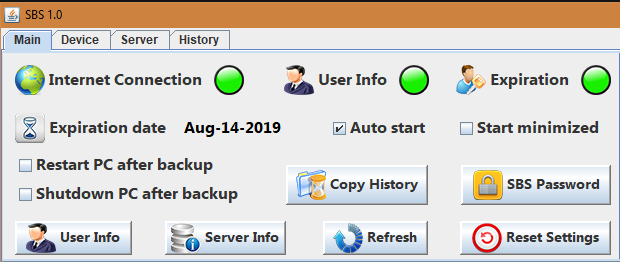

In "Home" the user has a check panel where he can modify general settings.

**Auto start**

This features allows SBS to automatically start after Windows login. If enabled, SBS will copy a link into Windows startup folder. Auto start works if there is a link in running folder named "SBS_1.0" (It's important to not add ".jar").

**Restart PC and Shutdown PC after backup**

Restart/Shutdown PC when backup is completed.

**Windows Features**

"Auto Start" and "Restart/Shutdown PC" features works in Windows environment only.

**Start Minimized**

If checked SBS will start directly in system tray.

**Copy History**

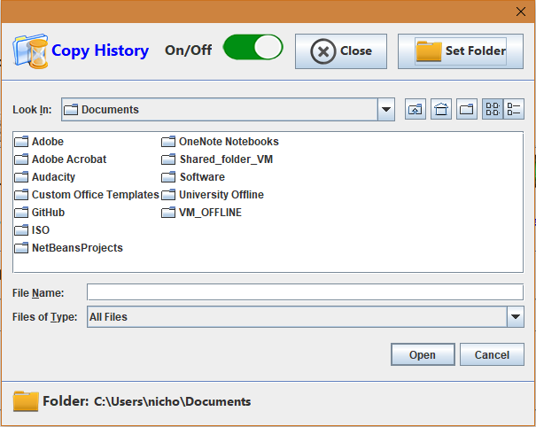

Allows user to have a copy of backup history in another folder. It will be updated after each backup.

**SBS Password**

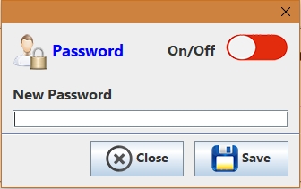

If enabled SBS will be protected by a password to prevent settings changes by other users.

### Autopilot

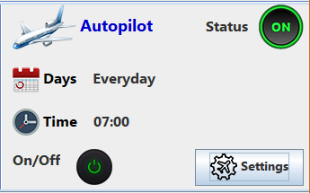

If enabled SBS will automatically start backup.

**Autopilot Settings**

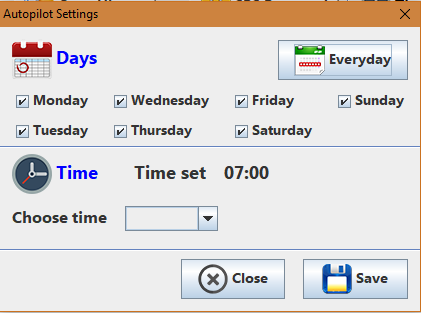

User can choose weekday and hour of backup.

# Server
Like Client, the Server works in all Java-supported platforms, however it has some features that works in Windows environment only. Server's task is to add new users, check incoming user connections, check license and store backup sent by client.

## Server Instructions

### First run
User must set "Connection Port" and "File Port" in **Server Settings** (click "Save" button to complete operation).

Note: if there is not internet connection, the Server cannot get public IP address, as shown in previous picture (privacy purpose).

### Main Settings
In this panel user can manage "Auto Start", "Start minimized", "Lock Password" (same Client features) and "Auto Online".

**Start**

To make Server online the user must click on "Start" button.

**Storage Limit**

This feature allows to set max storage limit per user. When client's folder exceeds storage limit, the Server will delete oldest backup. When "Storage Limit" settings is changed, it's important to update Server Info HTML file (see below).

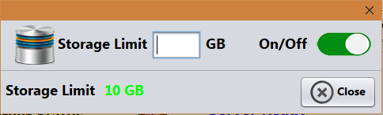

### Customers
In this panel user can check (by clicking "Refresh") and manage registered clients.

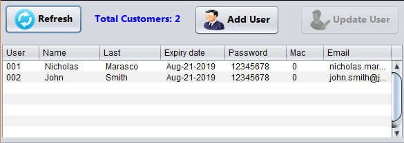

**User**

It is user code automatically assigned by Server, it is useful to login in Client Software.

**Expiry Date**

Each Client has a temporary licence. When a user exceeds "Expiry Date", the Client Software will be locked down, until the users database will be updated with a new date.

**Password**

It is the password that will be used to login in Client Software

**MAC**

Every time a Client connects to Server, it communicates the PC's MAC address. If it changes for more that 3 times, the Client will be locked down until Server will reset this counter. With this feature a user cannot share his licence to other users.

**Add User**

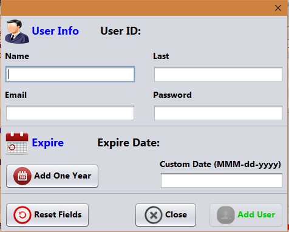

To add a client it's required to fill all fields, including **Expire Date** (to add one year from current date just click "Add One Year" button, otherwise add date manually). Once "Add User" button is clicked, a message will show "User Code" of the new User.

**Update User**

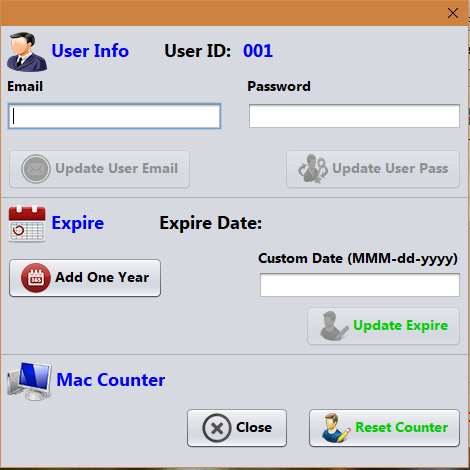

To change or update user infos, just click on user's row and then click on "Update User" button.

### Remote Settings

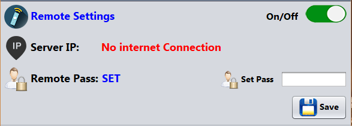

In this panel user can set the password that will be used in **Remote Software** to remotely access in Server. There is a button to switch on/off this feature.

### Server History

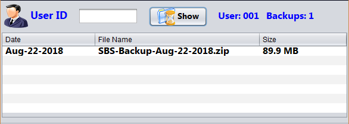

To check user's history enter "User Code" and press "Show" button.

# Remote
**SBS Remote** works in all java-supported platforms. This app can remotely control the Server.

### Actions
In this panel user can remotely **Shutdown** or **Reboot** Server PC. **Restart SBS** will restart Server app. These features works if Server is running on Windows PC.

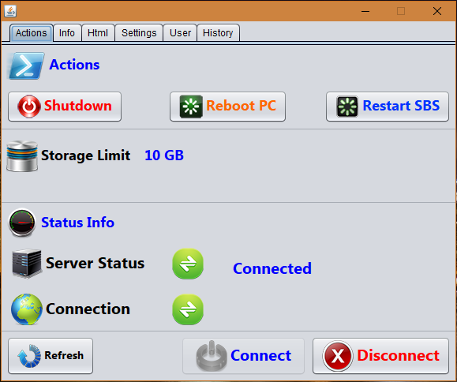

### Info
In this panel user can check "Server IP" and "Connection Port" in use.

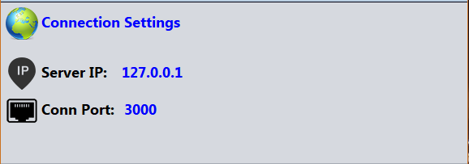

### HTML
In this panel user can create encrypted html file to upload in a host. It will be decrypted by Client to get Server info (IP, Connection Port, Storage Limit).

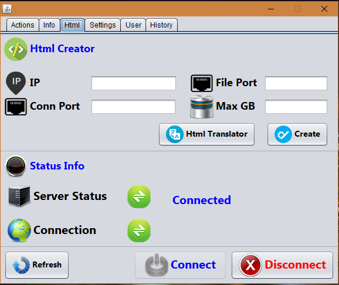

**HTML Translator**

User can decrypt html file.

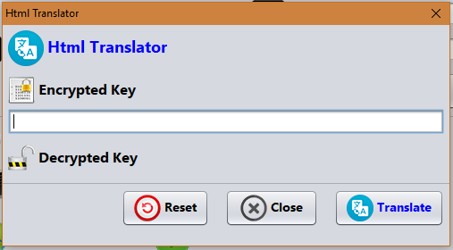

### Settings
To connect to Server user must enter **Server IP**, **Remote Port**, **Server Password** and click "Save" button.

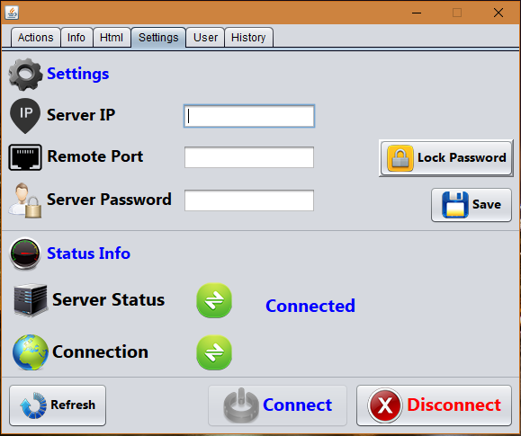

Note: For safety reason "Server Password" will not accept "0000"

### User and History
These two features works like Server's ones. The only difference is that in "Remote SBS" they works remotely.
